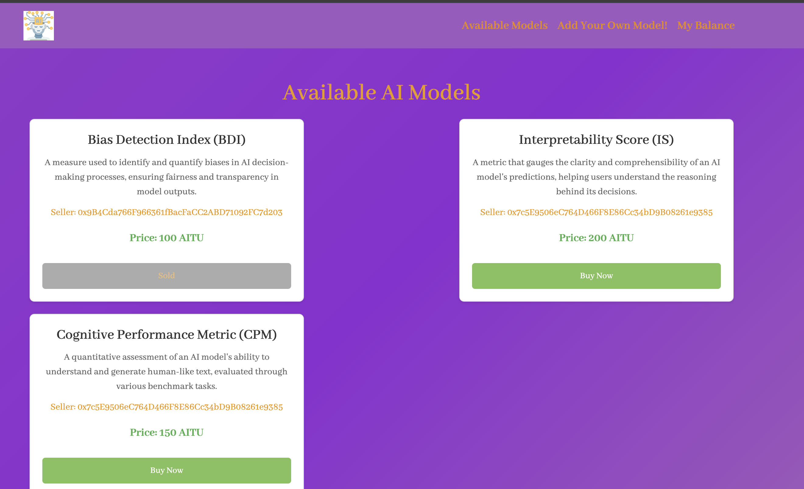
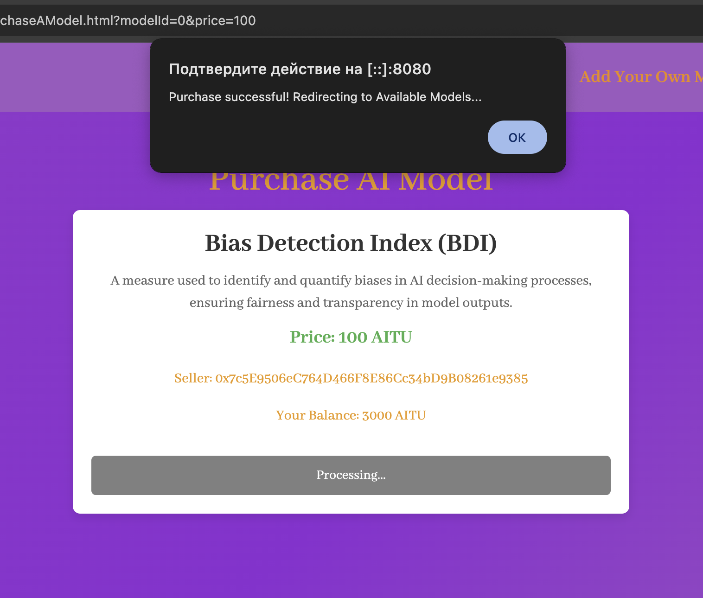
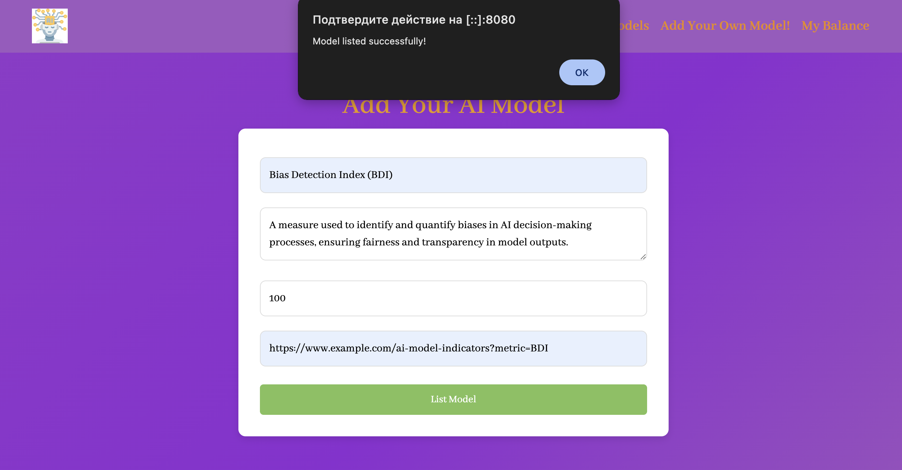
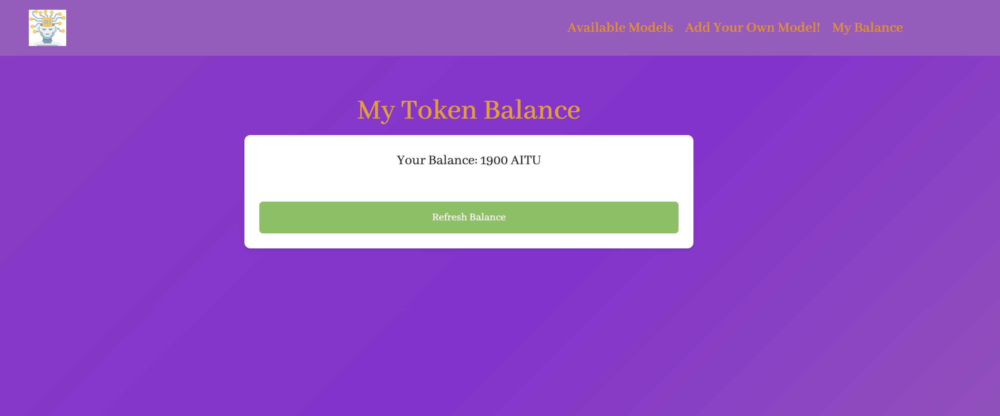

# **AI Model Marketplace**  

A decentralized **AI Model Marketplace** where users can **buy and sell AI models** using **ERC-20 tokens** on the **Holeshky Testnet**.  
This project integrates **Assignment 2 (Marketplace)** and **Assignment 3 (ERC-20 Token)** into a fully functional blockchain-based platform.  

---

## 📌 **Features**  

✔ **User Authentication & Wallet Integration** – Users can connect their wallets via **Metamask**.  
✔ **Token Balance Display** – Users can check and refresh their **ERC-20 AITU token** balance.  
✔ **AI Model Listings** – Users can list AI models with **name, description, price, and access link**.  
✔ **Secure Transactions** – Buyers can purchase AI models using ERC-20 tokens.  
✔ **Marketplace UI Updates** – Purchased models are marked as **"Sold"** in real-time.  
✔ **Hosted on Holeshky Testnet** – Deployed smart contracts for real blockchain interaction.  

---

## 🛠 **Technologies Used**  

- **Ethereum & Web3.js** – Blockchain interactions  
- **Solidity** – Smart contract development  
- **Metamask** – Wallet integration  
- **Holeshky Testnet** – Smart contract deployment  
- **Bootstrap 5** – UI design  

## **📑 Installation & Setup**  

### **1️⃣ Clone the Repository**  
```sh
git clone https://github.com/gemdivk/Assignment-4.git
cd AI-Model-Marketplace
```

### **2️⃣ To run it**  
```sh
python3 -m http.server 8080
```
---
## **📌 Pages & Functionality**  

### **🛒 1. Available AI Models (`AvailableModels.html`)**  
The main page displays all available AI models listed for sale.  

#### **🔹 What can you do here?**  
- **View AI models** (name, description, price, and seller).  
- **Check which models are sold** (they will have a "Sold" label).  
- **Click "Buy Now"** to purchase a model.  

#### **🔹 How it works?**  
- The page fetches the **total number of models** from the blockchain.  
- Each model is retrieved from the **smart contract** and displayed dynamically.  
- If a model is already purchased, the **"Buy Now"** button is disabled.  

**💻 Example JavaScript Code:**  
```js
async function loadModels() {
    const modelCount = await marketplaceContract.methods.getModelCount().call();
    const modelList = document.getElementById('modelList');
    modelList.innerHTML = "";

    for (let i = 0; i < modelCount; i++) {
        const model = await marketplaceContract.methods.models(i).call();
        const priceInAITU = web3.utils.fromWei(model.price, 'ether');

        const card = document.createElement('div');
        card.className = 'model-card';
        card.innerHTML = `
            <h3 class="model-title">${model.name}</h3>
            <p class="model-description">${model.description}</p>
            <p class="model-price">Price: ${priceInAITU} AITU</p>
            <p>Seller: ${model.creator}</p>
            <button class="btn" onclick="redirectToPurchase(${i}, '${priceInAITU}')" ${model.isSold ? "disabled" : ""}>
                ${model.isSold ? "Sold" : "Buy Now"}
            </button>
        `;
        modelList.appendChild(card);
    }
}
```

---

### **🛍️ 2. Purchase AI Model (`PurchaseAModel.html`)**  
The page where users **finalize their purchase** of an AI model.  

#### **🔹 What can you do here?**  
- **View the details of the selected AI model.**  
- **Click "Buy Now"** to pay for the model using ERC-20 tokens.  

#### **🔹 How it works?**  
- The model ID and price are **retrieved from the URL**.  
- The contract checks if the **buyer has enough tokens** to complete the transaction.  
- Once the transaction is **approved and completed**, the UI updates the model status to **"Sold"**.  

**💻 Example JavaScript Code:**  
```js
async function purchaseModel() {
    try {
        const accounts = await web3.eth.getAccounts();
        const userAddress = accounts[0];

        // Approve token spending
        await paymentToken.methods.approve(contractAddress, modelPrice).send({ from: userAddress });

        // Purchase the model
        await contract.methods.purchaseModel(modelId).send({ from: userAddress });

        alert("Purchase successful!");
        window.location.href = "AvailableModels.html"; // Redirect to models list
    } catch (error) {
        console.error("Error purchasing model:", error);
        alert("Failed to purchase the model!");
    }
}
```

---

### **📝 3. Add Your Own AI Model (`AddYourOwnModel.html`)**  
This page **allows users to list AI models** for sale on the blockchain.  

#### **🔹 What can you do here?**  
- **Enter the model name and description.**  
- **Set the price in AITU tokens.**  
- **Provide a model URL for buyers to download after purchase.**  
- **Click "List Model"** to upload the listing.  

#### **🔹 How it works?**  
- The user **inputs the model details**, which are sent to the **smart contract**.  
- The contract **stores the listing** and makes it available on the **Available Models page**.  

**💻 Example JavaScript Code:**  
```js
async function addModel() {
    const modelName = document.getElementById("modelName").value;
    const modelDescription = document.getElementById("modelDescription").value;
    const modelPrice = web3.utils.toWei(document.getElementById("modelPrice").value, 'ether');
    const modelUrl = document.getElementById("modelUrl").value;

    const accounts = await web3.eth.getAccounts();
    await contract.methods.listModel(modelName, modelDescription, modelPrice, modelUrl)
        .send({ from: accounts[0] });

    alert("Model listed successfully!");
}
```

---

### **💰 4. My Balance (`MyBalance.html`)**  
This page **displays the user’s ERC-20 token balance**.  

#### **🔹 What can you do here?**  
- **Check your balance in AITU tokens.**  
- **See the smart contract balance (if applicable).**  

#### **🔹 How it works?**  
- The page **retrieves the user’s balance** from the **AITU token contract**.  
- The UI updates dynamically to **reflect the latest balance**.  

**💻 Example JavaScript Code:**  
```js
async function getUserBalance() {
    const accounts = await web3.eth.getAccounts();
    const balance = await paymentToken.methods.balanceOf(accounts[0]).call();
    document.getElementById("balanceDisplay").innerText = `Balance: ${web3.utils.fromWei(balance, 'ether')} AITU`;
}
```

## 📄 **Assignment Requirements & Implementation**  

### **3.1 User Authentication and Wallet Integration**  
✅ **Implemented:**  
- Users can connect their MetaMask wallet.  
- The app detects if MetaMask is installed and requests access.  
- Wallet address is displayed after connection.  

🔹 **Code Example (Metamask Integration)**  
```js
async function connectWallet() {
    if (window.ethereum) {
        web3 = new Web3(window.ethereum);
        await window.ethereum.request({ method: "eth_requestAccounts" });
        const accounts = await web3.eth.getAccounts();
        document.getElementById("walletAddress").innerText = "Connected: " + accounts[0];
    } else {
        alert("Please install MetaMask!");
    }
}
```

---

### **3.2 Token Balance Display**  
✅ **Implemented:**  
- Users can see their **AITU token balance** on the **MyBalance.html** page.  
- **"Refresh Balance"** button updates the token balance.  

🔹 **Code Example (Fetch User Balance)**  
```js
async function updateBalance() {
    const accounts = await web3.eth.getAccounts();
    const balance = await tokenContract.methods.balanceOf(accounts[0]).call();
    document.getElementById("userBalance").innerText = `Balance: ${web3.utils.fromWei(balance, 'ether')} AITU`;
}
```

---

### **3.3 AI Model Listings**  
✅ **Implemented:**  
- Sellers can list AI models with **name, description, price, and model URL**.  
- Models are stored **on-chain** and retrieved dynamically.  
- The marketplace displays **all available AI models**.  

🔹 **Code Example (List New Model)**  
```js
async function addModel() {
    const name = document.getElementById('modelName').value;
    const description = document.getElementById('modelDescription').value;
    let price = web3.utils.toWei(document.getElementById('modelPrice').value, 'ether');
    const modelUrl = document.getElementById('modelUrl').value;

    const accounts = await web3.eth.getAccounts();
    await marketplaceContract.methods.listModel(name, description, price, modelUrl).send({ from: accounts[0] });

    alert("Model listed successfully!");
    window.location.href = "AvailableModels.html";
}
```

---

### **3.4 Purchase Flow**  
✅ **Implemented:**  
- Buyers can **view AI model details** before purchasing.  
- **ERC-20 token approval** is required before making a purchase.  
- The UI updates **immediately** after a model is purchased.  

🔹 **Code Example (Purchase Model)**  
```js
async function purchaseModel() {
    const accounts = await web3.eth.getAccounts();
    const purchaseBtn = document.getElementById("purchaseBtn");

    purchaseBtn.innerText = "Processing...";
    purchaseBtn.disabled = true;

    try {
        const allowance = await tokenContract.methods.allowance(accounts[0], marketplaceAddress).call();
        if (parseInt(allowance) < parseInt(modelPrice)) {
            await tokenContract.methods.approve(marketplaceAddress, modelPrice).send({ from: accounts[0] });
        }

        await marketplaceContract.methods.purchaseModel(modelId).send({ from: accounts[0] });

        alert("Purchase successful!");
        window.location.href = "AvailableModels.html";  
    } catch (error) {
        console.error("Error purchasing model:", error);
        alert("Purchase failed!");
        purchaseBtn.innerText = "Buy Now";
        purchaseBtn.disabled = false;
    }
}
```

---


## 🚀 **How to Use**  

### **1️⃣ Connect to Holeshky Testnet**  
- Open **MetaMask** → Switch to **Holeshky Testnet**.  

### **2️⃣ Get Test Tokens**  
- Use a **Holeshky faucet** to get test **AITU tokens**.  

### **3️⃣ List an AI Model**  
- Go to **AddYourOwnModel.html**.  
- Enter details and approve ERC-20 token transfer.  

### **4️⃣ Buy an AI Model**  
- Visit **AvailableModels.html** and select a model.  
- Click **"Buy Now"**, confirm the transaction in MetaMask.  
- Model will update to "Sold".  

### **5️⃣ Check Balance**  
- Open **MyBalance.html** to view ERC-20 token balance.  

---

## 📜 **Smart Contracts**  

📌 **ERC-20 Token Contract (AITU Token)**  
```solidity
// SPDX-License-Identifier: MIT
pragma solidity ^0.8.0;
import "@openzeppelin/contracts/token/ERC20/ERC20.sol";
contract AITU_Token is ERC20 {
    constructor(uint256 initialSupply) ERC20("AITU", "AITU") {
        _mint(msg.sender, initialSupply * 10 ** decimals());
    }
}
```

📌 **Marketplace Contract**  
```solidity
// SPDX-License-Identifier: MIT
pragma solidity ^0.8.0;
import "@openzeppelin/contracts/token/ERC20/IERC20.sol";
import "@openzeppelin/contracts/access/Ownable.sol";
contract AIModelMarketplace is Ownable {
    struct Model { string name; string description; uint256 price; address creator; bool isSold; }
    Model[] public models;
    mapping(uint256 => mapping(address => bool)) public hasPurchased;
    IERC20 public paymentToken;
    constructor(address _tokenAddress) Ownable(msg.sender) { paymentToken = IERC20(_tokenAddress); }
    function listModel(string memory name, string memory description, uint256 price) public { models.push(Model(name, description, price, msg.sender, false)); }
    function purchaseModel(uint256 modelId) public { require(!models[modelId].isSold, "Already sold"); paymentToken.transferFrom(msg.sender, models[modelId].creator, models[modelId].price); models[modelId].isSold = true; }
}
```

---

## 🚀 **Deployment on Holeshky Testnet**  
📌 **Deployed Contract Addresses:**  
- **Marketplace Contract:** `0x43f5a970B866Bea9d1F17De2fe5dBFe6CEE35128`  
- **AITU Token Contract:** `0x68299A7DC3276b988766853E9CBDD1087285C6D7`

📌 **Testnet Block Explorer:**  
- View transactions on **[Holeshky Etherscan](https://etherscan.io/)**  

---

## **📸 Demo Screenshots**  
| 📍 Available Models | 📍 Purchase Flow | 📍 Listing a Model | 📍 My Balance |
|---------------------|-----------------|--------------------|---------------|
|  |  |  | 


💡 **Built with Solidity, Web3.js & Holeshky Testnet 🚀**  
